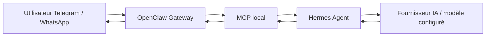

# Hermes + OpenClaw Gateway

## Pitch en 30 secondes

Ce dépôt prépare un assistant personnel auto-hébergé sur VPS Ubuntu 24.04.
L'utilisateur écrit depuis Telegram, puis WhatsApp plus tard.
OpenClaw joue le rôle de gateway de messagerie.
MCP relie la gateway à Hermes.
Hermes choisit le fournisseur IA et le modèle configurés, rédige une réponse courte, puis OpenClaw la renvoie à l'utilisateur.

Le dépôt est conçu comme un portfolio technique : documentation claire, scripts relisibles, service systemd utilisateur, règles de sécurité, sauvegardes et validations locales.

> Avertissement : aucun secret réel ne doit être stocké dans ce dépôt. Utiliser uniquement `.env.example` et les placeholders documentés.

## Architecture ASCII

```text
Utilisateur Telegram / WhatsApp
        |
        v
OpenClaw Gateway locale sur VPS
        |
        v
MCP local, non exposé publiquement
        |
        v
Hermes Agent
        |
        v
Fournisseur IA / modèle configuré
        |
        v
Hermes rédige une réponse courte
        |
        v
OpenClaw envoie la réponse
```

## Diagramme Mermaid



## Stack technique

- VPS Ubuntu 24.04.
- Utilisateur Linux non-root.
- OpenClaw Gateway pour la réception et l'envoi des messages.
- MCP comme pont contrôlé entre OpenClaw et Hermes.
- Hermes comme cerveau applicatif.
- Fournisseur IA configurable via variables d'environnement locales.
- Service systemd utilisateur : `hermes-openclaw-loop.service`.
- Docker Engine et Docker Compose v2 avec `docker compose` si plusieurs services persistants deviennent nécessaires.
- Node.js LTS compatible avec OpenClaw, à vérifier selon la version officielle d'OpenClaw.
- Scripts Bash sûrs pour boucle, santé et sauvegarde.

## État du projet

- [x] Documentation portfolio réorientée vers Hermes + OpenClaw.
- [x] Garde-fous secrets avec `.gitignore` et `.env.example`.
- [x] Scripts d'exemple sans secret.
- [x] Unité systemd utilisateur.
- [x] Runbook d'exploitation et sécurité.
- [ ] Validation réelle Telegram sur VPS.
- [ ] Validation réelle OpenClaw Gateway.
- [ ] Validation réelle Hermes.
- [ ] Validation réelle MCP.
- [ ] Validation réelle du service systemd utilisateur.
- [ ] Validation réelle sauvegarde/restauration.

## Documentation

- [Installation](docs/INSTALL.md)
- [Runbook](docs/RUNBOOK.md)
- [Sécurité](docs/SECURITY.md)
- [Sauvegardes](docs/BACKUP.md)
- [Décisions ADR](docs/DECISIONS.md)
- [Architecture détaillée](docs/ARCHITECTURE.md)
- [Roadmap](ROADMAP.md)
- [Changelog](CHANGELOG.md)

## Ce qui est fait

- Structure documentaire pour un VPS Ubuntu 24.04.
- Architecture cible OpenClaw -> MCP -> Hermes.
- Exemples de scripts Bash avec `set -euo pipefail`.
- Service systemd utilisateur sans secret et sans `User=`.
- Politique claire : OpenClaw et MCP restent locaux, non exposés publiquement.
- Dossier `docs/incidents/` prêt pour les comptes rendus d'incident.
- Dossier `screenshots/` prêt pour des preuves floutées.

## Ce qui reste à faire

- Valider les commandes officielles OpenClaw selon la version installée.
- Valider les commandes officielles Hermes selon la version installée.
- Tester Telegram sur un vrai bot avec un token local non commité.
- Tester MCP de bout en bout sur VPS.
- Tester l'unité `hermes-openclaw-loop.service` avec `systemctl --user`.
- Tester une restauration de sauvegarde sur une machine de test.
- Ajouter monitoring, alerting et CI/CD dans une étape ultérieure.
- Décider quoi faire des anciens éléments de lab réseau/FastAPI encore présents.

## Ancien contenu conservé

Le dépôt contenait déjà un lab réseau/FastAPI avec `app/`, `ansible/`, `compose.yaml`, `Makefile`, des scripts et des documents historiques.
Ces fichiers ne sont pas supprimés brutalement.
Ils sont conservés comme héritage à trier progressivement.
Voir [note de migration legacy](docs/legacy/README.md).

## Règles pour captures et preuves

Avant publication GitHub ou portfolio :

- flouter les IP ;
- flouter les tokens ;
- flouter les noms ;
- flouter les messages privés ;
- flouter les QR codes ;
- ne jamais publier une capture brute.

## Secrets interdits

Ne jamais commiter :

- clé API réelle ;
- token Telegram réel ;
- fichier `.env` réel ;
- session WhatsApp ;
- clé SSH privée ;
- sauvegarde réelle ;
- log contenant des messages privés ;
- capture non floutée.

Utiliser uniquement les placeholders : `<votre_token>`, `<votre_cle>`, `<ip_du_serveur>`, `<utilisateur>`, `<URL_DU_DEPOT_GITHUB>`.
