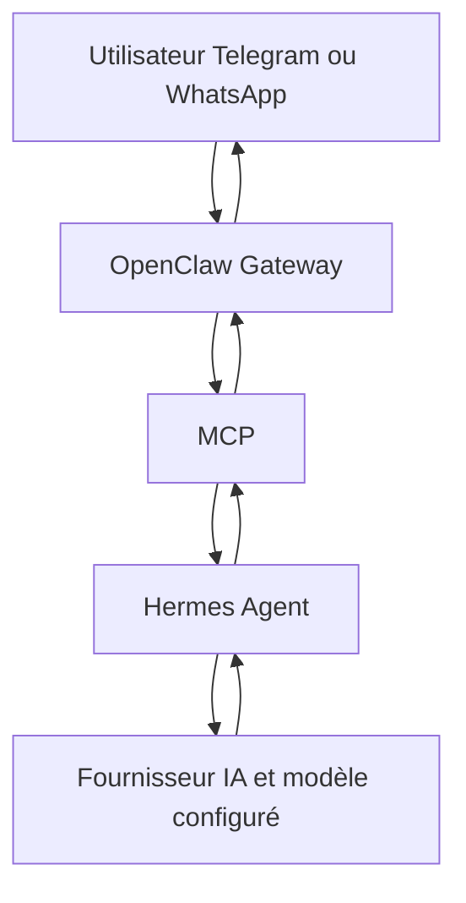

# Hermes + OpenClaw Gateway

## Pitch en 30 secondes

Ce dépôt prépare un assistant personnel auto-hébergé sur un VPS Ubuntu 24.04.
L'objectif est de recevoir un message Telegram, puis WhatsApp plus tard, de le faire passer par OpenClaw Gateway, MCP et Hermes Agent, puis de renvoyer une réponse courte via OpenClaw.
Le dépôt sert de base portfolio : documentation claire, scripts prudents, service systemd utilisateur, règles de sécurité et procédures de validation.

> Aucun secret réel ne doit être versionné dans ce dépôt.
> Les fichiers de configuration réels restent locaux au VPS ou au poste de travail.

## Architecture cible

```text
Utilisateur Telegram/WhatsApp
          |
          v
  OpenClaw Gateway
          |
          v
        MCP
          |
          v
    Hermes Agent
          |
          v
Fournisseur IA / modèle configuré
          |
          v
Réponse renvoyée via OpenClaw
```



## Stack technique

- VPS Ubuntu 24.04.
- Utilisateur Linux non-root.
- OpenClaw Gateway pour les canaux de messagerie.
- MCP comme pont d'outils entre OpenClaw et Hermes.
- Hermes Agent comme cerveau conversationnel.
- Fournisseur IA configurable par variables d'environnement locales.
- Node.js LTS compatible avec OpenClaw, à vérifier selon la version officielle utilisée.
- Docker Engine et Docker Compose v2 avec `docker compose`, optionnels pour le MVP.
- systemd utilisateur pour maintenir la boucle active.

## État du projet

- [x] Documentation de l'architecture cible.
- [x] Procédures d'installation manuelles.
- [x] Runbook d'exploitation.
- [x] Règles de sécurité et de secrets.
- [x] Exemple de sauvegarde locale.
- [x] Service systemd utilisateur.
- [x] Scripts de boucle, santé et sauvegarde.
- [ ] Validation réelle Telegram sur VPS.
- [ ] Validation réelle OpenClaw Gateway.
- [ ] Validation réelle Hermes.
- [ ] Validation réelle MCP.
- [ ] Validation réelle sauvegarde/restauration.
- [ ] Intégration WhatsApp.

## Documentation

- [Installation](docs/INSTALL.md)
- [Runbook](docs/RUNBOOK.md)
- [Sécurité](docs/SECURITY.md)
- [Sauvegardes](docs/BACKUP.md)
- [Décisions ADR](docs/DECISIONS.md)
- [Architecture détaillée](docs/ARCHITECTURE.md)
- [Roadmap](ROADMAP.md)
- [Changelog](CHANGELOG.md)

## Ce qui est fait

- Le dépôt est recentré sur Hermes + OpenClaw Gateway.
- Les anciens contenus de lab réseau et FastAPI sont conservés sans suppression brutale.
- Les chemins historiques restent visibles pour une future migration prudente vers `docs/legacy/` si nécessaire.
- Les exemples utilisent uniquement des placeholders comme `<votre_token>`, `<votre_cle>`, `<ip_du_serveur>`, `<utilisateur>` et `<URL_DU_DEPOT_GITHUB>`.
- `.env.example` est versionnable, mais aucun `.env` réel ne doit être commité.

## Ce qui reste à faire

- Vérifier les commandes exactes OpenClaw et Hermes avec les versions officielles installées.
- Installer et tester le système sur un vrai VPS Ubuntu 24.04.
- Valider le flux Telegram de bout en bout.
- Ajouter WhatsApp après stabilisation de Telegram.
- Ajouter monitoring, alerting et CI/CD plus tard.
- Décider quoi faire des anciens fichiers hors périmètre : conservation, adaptation ou migration vers `docs/legacy/`.

## Règles pour captures et preuves

Avant toute publication dans `screenshots/` ou dans une PR :

- flouter les IP ;
- flouter les tokens ;
- flouter les noms ;
- flouter les messages privés ;
- flouter les QR codes ;
- ne jamais publier une capture brute.

## Avertissement sécurité

Ce dépôt ne contient pas de secrets réels.
Ne commitez jamais de clé API, token Telegram, session WhatsApp, clé SSH privée, sauvegarde réelle, log privé ou capture non floutée.
