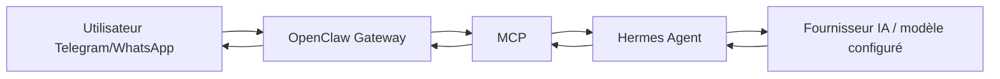

# Hermes + OpenClaw Gateway

## Pitch en 30 secondes

Ce dépôt prépare un assistant personnel auto-hébergé sur un VPS Ubuntu 24.04. L'objectif est de recevoir un message depuis Telegram, puis WhatsApp plus tard, de le faire passer par OpenClaw Gateway, MCP et Hermes Agent, puis de renvoyer une réponse courte via OpenClaw. Le dépôt sert de portfolio technique : documentation claire, scripts sûrs, unité systemd utilisateur, règles de sécurité et validations locales.

> Aucun secret réel ne doit être commité dans ce dépôt. Utiliser uniquement `.env.example` et les placeholders documentés.

## Architecture cible

```text
Utilisateur Telegram/WhatsApp
        |
        v
+---------------------+
| OpenClaw Gateway    |
| Entrée/sortie chat  |
+---------------------+
        |
        v
+---------------------+
| MCP                 |
| Pont outillé        |
+---------------------+
        |
        v
+---------------------+
| Hermes Agent        |
| Orchestration IA    |
+---------------------+
        |
        v
+-----------------------------+
| Fournisseur IA / modèle     |
| configuré hors Git          |
+-----------------------------+
        |
        v
Réponse envoyée via OpenClaw
```



## Stack technique

- VPS Ubuntu 24.04.
- Utilisateur non-root.
- OpenClaw Gateway pour les canaux Telegram/WhatsApp.
- MCP comme pont entre Gateway et agent.
- Hermes Agent comme cerveau applicatif.
- Fournisseur IA configurable via variables d'environnement locales.
- Node.js LTS compatible avec OpenClaw, à vérifier selon la version officielle utilisée.
- Docker Engine et Docker Compose v2 avec `docker compose`, optionnels pour le MVP.
- systemd utilisateur pour maintenir la boucle d'orchestration.
- Bash pour les scripts d'aide locaux.

## État du projet

- [x] Documentation cible du projet créée.
- [x] Règles de sécurité et de non-publication des secrets documentées.
- [x] Scripts d'exemple sûrs ajoutés.
- [x] Unité systemd utilisateur fournie.
- [x] Structure `docs/incidents/` et `screenshots/` préparée.
- [ ] Installation réelle OpenClaw à valider sur VPS.
- [ ] Installation réelle Hermes à valider sur VPS.
- [ ] Configuration MCP réelle à valider.
- [ ] Test Telegram réel à exécuter.
- [ ] WhatsApp à traiter plus tard.

## Documentation principale

- [Installation](docs/INSTALL.md)
- [Runbook d'exploitation](docs/RUNBOOK.md)
- [Sécurité](docs/SECURITY.md)
- [Sauvegardes](docs/BACKUP.md)
- [Décisions techniques](docs/DECISIONS.md)
- [Architecture détaillée](docs/ARCHITECTURE.md)

## Ce qui est fait

- Réorientation du dépôt vers Hermes + OpenClaw Gateway.
- Documentation d'installation manuelle pour Ubuntu 24.04.
- Runbook d'exploitation et de diagnostic.
- Checklist de sécurité avant publication GitHub.
- Script de boucle avec arrêt propre et délai configurable.
- Script de healthcheck basé sur les exit codes.
- Script de sauvegarde d'exemple sans transfert automatique.
- Unité systemd utilisateur `hermes-openclaw-loop.service`.

## Ce qui reste à faire

- Tester OpenClaw Gateway sur un VPS réel.
- Tester Hermes Agent sur un VPS réel.
- Valider la configuration MCP OpenClaw vers Hermes.
- Connecter Telegram avec un token réel stocké hors Git.
- Évaluer WhatsApp après stabilisation Telegram.
- Ajouter monitoring, alerting et CI/CD.
- Décider quoi faire des anciens contenus de lab réseau/FastAPI conservés dans le dépôt.

## Contenus legacy conservés

Le dépôt contient encore des éléments de lab réseau/FastAPI, par exemple `app/`, `compose.yaml`, `ansible/`, `openclaw/allowlists/` et certains documents historiques. Ils ne sont pas supprimés brutalement. La migration recommandée est de les déplacer progressivement vers `docs/legacy/` ou de les adapter si certains éléments restent utiles au projet Hermes + OpenClaw.

## Règles de captures d'écran

Avant toute publication, flouter les IP, tokens, noms, messages privés et QR codes. Ne jamais publier une capture brute.
