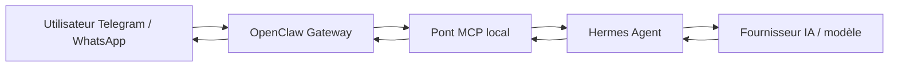

# Hermes + OpenClaw Gateway

## Pitch en 30 secondes

Ce dépôt prépare un assistant personnel auto-hébergé sur VPS Ubuntu 24.04.
L'utilisateur échange depuis Telegram d'abord, puis WhatsApp plus tard.
OpenClaw joue le rôle de passerelle de messages.
MCP relie la passerelle à Hermes.
Hermes choisit le fournisseur IA et le modèle configurés localement.
Le dépôt documente l'installation, l'exploitation, la sécurité, les sauvegardes
et les limites avant une mise en production réelle.

> Aucun secret réel ne doit être commité dans ce dépôt : pas de clé API, pas de
> token Telegram, pas de fichier `.env` réel, pas de session WhatsApp, pas de
> clé SSH privée, pas de sauvegarde réelle et pas de log privé.

## Architecture ASCII

```text
Utilisateur Telegram / WhatsApp
        |
        v
OpenClaw Gateway local sur VPS
        |
        v
Pont MCP local
        |
        v
Hermes Agent
        |
        v
Fournisseur IA / modèle configuré
        |
        v
Réponse renvoyée par OpenClaw
```

## Diagramme Mermaid



## Stack technique

| Couche | Choix | Statut |
|---|---|---|
| OS cible | Ubuntu Server 24.04 | Documenté, à valider sur VPS |
| Messagerie MVP | Telegram | Prioritaire |
| Messagerie future | WhatsApp | Plus tard, après sécurité et sauvegardes |
| Gateway | OpenClaw | À installer manuellement selon documentation officielle |
| Pont | MCP | À valider avec OpenClaw et Hermes |
| Agent | Hermes | À installer manuellement selon documentation officielle |
| Runtime potentiel | Node.js LTS compatible avec OpenClaw | Sans version figée ici |
| Conteneurs | Docker Engine + `docker compose` | Optionnel pour le MVP |
| Supervision locale | Service systemd utilisateur | Préparé |
| Sauvegardes | Archive locale puis chiffrement | Script exemple fourni |

## État du projet

- [x] Documentation portfolio orientée Hermes + OpenClaw.
- [x] Architecture cible documentée.
- [x] Règles de sécurité et de secrets documentées.
- [x] Exemples de scripts locaux non destructifs ajoutés.
- [x] Unité systemd utilisateur préparée.
- [x] Exemple `.env.example` sans secret réel.
- [x] Emplacements `docs/incidents/` et `screenshots/` préparés.
- [ ] Validation réelle Telegram sur VPS.
- [ ] Validation réelle OpenClaw Gateway.
- [ ] Validation réelle Hermes.
- [ ] Validation réelle MCP OpenClaw vers Hermes.
- [ ] Validation réelle du service `hermes-openclaw-loop.service`.
- [ ] Test de sauvegarde/restauration chiffrée.

## Documentation principale

- [Installation](docs/INSTALL.md)
- [Runbook d'exploitation](docs/RUNBOOK.md)
- [Sécurité](docs/SECURITY.md)
- [Sauvegarde et restauration](docs/BACKUP.md)
- [Décisions d'architecture](docs/DECISIONS.md)
- [Architecture détaillée](docs/ARCHITECTURE.md)

## Ce qui est fait

- Le dépôt est recentré sur le projet Hermes + OpenClaw Gateway.
- Les anciens éléments de lab réseau/FastAPI sont conservés pour migration
  prudente : `app/`, `ansible/`, `compose.yaml`, `openclaw/`, `outputs/` et les
  anciennes notes dans `docs/`.
- Les secrets restent hors Git grâce à `.gitignore` et `.env.example`.
- Les commandes VPS dangereuses sont documentées comme commandes manuelles.
- Les scripts ajoutés ne contiennent aucun token et ne journalisent pas les
  messages privés.

## Ce qui reste à faire

- Vérifier les commandes officielles OpenClaw et Hermes selon leurs versions.
- Installer manuellement OpenClaw et Hermes sur un VPS Ubuntu 24.04 de test.
- Configurer Telegram avec un token réel uniquement dans un `.env` local.
- Valider le pont MCP avec un scénario contrôlé.
- Activer le service systemd utilisateur et observer les logs sans contenu privé.
- Chiffrer les sauvegardes avant tout stockage hors VPS.
- Décider quoi faire des anciens fichiers de lab : conserver en annexe,
  déplacer progressivement vers `docs/legacy/`, ou supprimer dans une PR dédiée.

## Règles pour captures et preuves

Toute capture publiée doit être relue et floutée avant commit : IP, tokens, noms,
messages privés et QR codes doivent être masqués. Une capture brute ne doit jamais
être publiée dans le dépôt.
