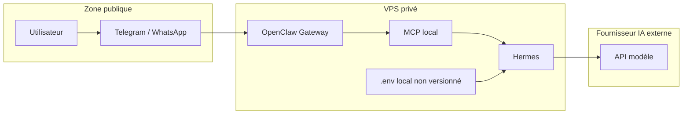

# Architecture Hermes + OpenClaw Gateway

## Flux de messages

1. L'utilisateur envoie un message via Telegram pour le MVP.
2. OpenClaw Gateway reçoit l'événement de messagerie.
3. Le pont MCP expose à Hermes les actions autorisées.
4. Hermes lit le contexte minimal nécessaire.
5. Hermes appelle le fournisseur IA et le modèle configurés.
6. Hermes produit une réponse courte.
7. OpenClaw renvoie la réponse à l'utilisateur.

```text
Utilisateur -> OpenClaw -> MCP -> Hermes -> Fournisseur IA
Utilisateur <- OpenClaw <- MCP <- Hermes <- Fournisseur IA
```

## Composants

| Composant | Rôle | Données sensibles |
|---|---|---|
| Telegram | Canal MVP | Token bot, messages privés |
| WhatsApp | Canal futur | Session, QR code, messages privés |
| OpenClaw Gateway | Réception et envoi des messages | Sessions, état gateway |
| MCP | Pont d'outils local | Capacités exposées à Hermes |
| Hermes | Agent et orchestration IA | Prompts, clés fournisseur via environnement |
| Fournisseur IA | Génération de réponse | Clé API, contenu envoyé |
| systemd user | Maintien de la boucle | Environnement local |

## Responsabilités

OpenClaw :

- recevoir les événements ;
- fournir l'accès aux conversations autorisées ;
- envoyer les réponses ;
- ne pas journaliser le contenu privé dans ce dépôt.

MCP :

- exposer seulement les outils nécessaires ;
- rester local ;
- limiter les actions dangereuses.

Hermes :

- construire la requête IA ;
- appliquer les consignes de réponse courte ;
- choisir le fournisseur et le modèle configurés.

Service systemd utilisateur :

- lancer `scripts/loop.sh` ;
- redémarrer en cas d'arrêt ;
- ne pas contenir de secret.

## Limites de confiance



Frontières :

- Internet public vers VPS : aucun port OpenClaw/MCP public attendu.
- VPS vers fournisseur IA : sortie réseau contrôlée par le fournisseur choisi.
- Git vers local : Git ne reçoit pas les secrets de `.env`, `~/.openclaw` ou
  `~/.hermes`.

## Ports et exposition réseau

| Élément | Exemple | Exposition recommandée |
|---|---|---|
| SSH | 22/tcp | Public mais limité par clé et UFW |
| OpenClaw Gateway | `127.0.0.1:18789` | Local uniquement |
| MCP | Port local selon configuration | Local uniquement |
| Docker Compose futur | Selon services | Non public par défaut |
| Fournisseur IA | HTTPS sortant | Sortant uniquement |

Si une administration distante est nécessaire, utiliser un tunnel SSH :

```bash
ssh -L 18789:127.0.0.1:18789 <utilisateur>@<ip_du_serveur>
```

Résultat attendu : le service distant reste lié à `127.0.0.1` côté VPS.
