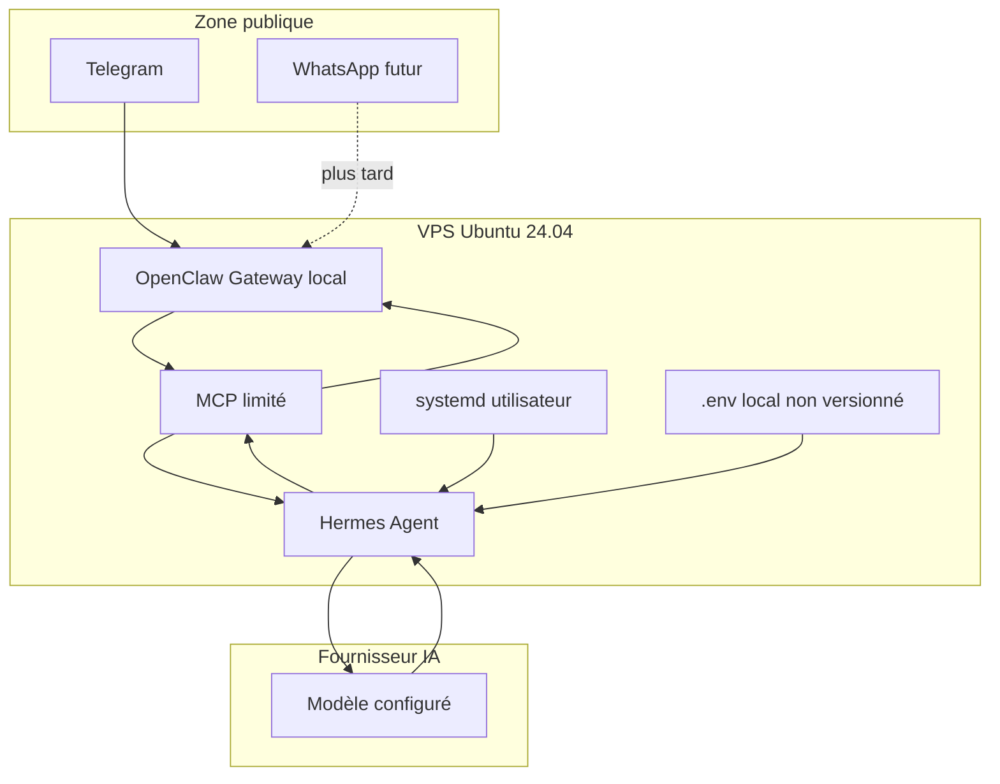

# Architecture Hermes + OpenClaw Gateway

## Flux de messages

1. L'utilisateur envoie un message Telegram.
2. OpenClaw Gateway reçoit l'événement.
3. MCP expose à Hermes des outils limités pour lire l'événement.
4. Hermes Agent construit une réponse courte avec le fournisseur IA configuré.
5. Hermes demande à MCP d'envoyer la réponse.
6. OpenClaw Gateway publie la réponse vers Telegram.
7. WhatsApp sera ajouté après validation du MVP Telegram.

## Composants

| Composant | Rôle | Statut |
|---|---|---|
| Telegram | Canal MVP | À valider en réel |
| WhatsApp | Canal futur | Reporté |
| OpenClaw Gateway | Entrée/sortie des messages | À installer sur VPS |
| MCP | Pont outillé limité | À configurer |
| Hermes Agent | Orchestration et raisonnement | À installer sur VPS |
| Fournisseur IA | Génération de réponse | Configuré hors Git |
| systemd utilisateur | Supervision de la boucle | Unité fournie |

## Responsabilités

- OpenClaw : recevoir et envoyer les messages.
- MCP : limiter et structurer les actions accessibles.
- Hermes : décider quoi répondre et quand appeler les outils.
- Fournisseur IA : générer la réponse selon le modèle configuré.
- Scripts Bash : aider au lancement, au diagnostic et à la sauvegarde.
- systemd : relancer la boucle en cas d'arrêt.

## Limites de confiance

```text
Internet / utilisateurs
        |
        | canal messagerie
        v
OpenClaw local sur VPS
        |
        | outils MCP limités
        v
Hermes local sur VPS
        |
        | appel API sortant chiffré
        v
Fournisseur IA externe
```

Les secrets restent dans l'environnement local du VPS. Le dépôt GitHub ne contient que des placeholders.

## Schéma Mermaid



## Ports et exposition réseau

| Élément | Adresse recommandée | Exposition |
|---|---|---|
| OpenClaw Gateway | `127.0.0.1:18789` | Non public |
| MCP | Localhost ou socket local | Non public |
| SSH | Port administré par le VPS | Public limité par UFW |
| Fournisseur IA | Connexion sortante HTTPS | Sortant uniquement |
| Docker Compose optionnel | Selon service | Non public par défaut |

Ne pas exposer OpenClaw Gateway ou MCP directement sur Internet. Pour un diagnostic temporaire, préférer un tunnel SSH.
