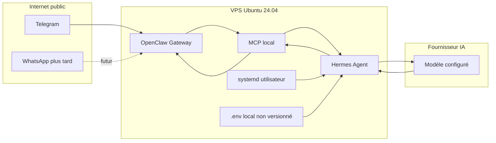

# Architecture Hermes + OpenClaw Gateway

## Flux de messages

1. Un utilisateur envoie un message Telegram, puis WhatsApp plus tard.
2. OpenClaw Gateway reçoit l'événement de messagerie.
3. MCP expose à Hermes les actions autorisées sur OpenClaw.
4. Hermes lit le contexte nécessaire sans journaliser le message privé.
5. Hermes appelle le fournisseur IA et le modèle configurés localement.
6. Hermes prépare une réponse courte.
7. OpenClaw renvoie la réponse à l'utilisateur.

## Composants

| Composant | Rôle | Exposition |
| --- | --- | --- |
| Telegram | Canal MVP | Internet via Telegram |
| WhatsApp | Canal futur | Internet via WhatsApp |
| OpenClaw Gateway | Entrée et sortie messages | Locale ou privée |
| MCP | Pont d'outils | Local uniquement |
| Hermes Agent | Décision et réponse | Local uniquement |
| Fournisseur IA | Génération modèle | API externe configurée |
| systemd utilisateur | Supervision boucle | Local |

## Responsabilités

- OpenClaw : connecteurs de messagerie, réception et envoi.
- MCP : exposition contrôlée des outils OpenClaw.
- Hermes : orchestration, lecture du contexte, génération de réponse.
- Scripts : boucle prudente, santé, sauvegarde.
- systemd : redémarrage automatique sans privilège root.

## Limites de confiance

```text
Internet public
  | Telegram / WhatsApp
  v
Frontière canal externe
  | OpenClaw local
  v
Frontière VPS privé
  | MCP local
  v
Hermes + secrets locaux
  | API fournisseur IA
  v
Frontière fournisseur externe
```

Les secrets restent côté VPS.
Les messages privés ne doivent pas être copiés dans les logs, captures ou incidents.

## Schéma Mermaid



## Ports et exposition réseau

| Élément | Port indicatif | Exposition recommandée |
| --- | --- | --- |
| SSH | 22 | Public limité par clé et UFW |
| OpenClaw Gateway | 18789 | `127.0.0.1` uniquement |
| MCP | Variable selon version | `127.0.0.1` uniquement |
| Fournisseur IA | HTTPS sortant | Sortant uniquement |

Le port `18789` est un exemple local documenté dans `.env.example`.
Vérifiez le port réel selon la configuration OpenClaw.
