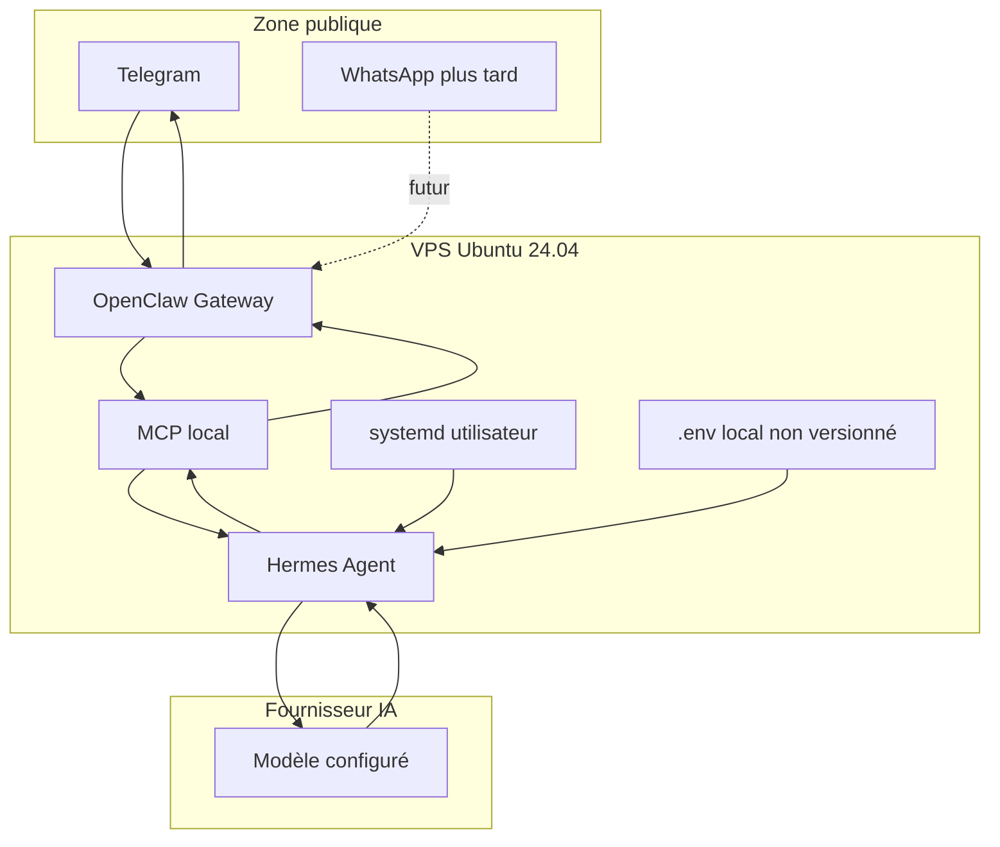

# Architecture Hermes + OpenClaw Gateway

## Flux de messages

1. L'utilisateur envoie un message Telegram.
2. Plus tard, le même principe pourra s'appliquer à WhatsApp.
3. OpenClaw Gateway reçoit l'événement.
4. MCP expose à Hermes uniquement les actions nécessaires.
5. Hermes lit le contexte autorisé.
6. Hermes appelle le fournisseur IA et le modèle configurés localement.
7. Hermes rédige une réponse courte.
8. OpenClaw renvoie la réponse à l'utilisateur.

## Composants

| Composant | Responsabilité |
|---|---|
| Telegram | Canal MVP de l'utilisateur |
| WhatsApp | Canal futur, non MVP |
| OpenClaw Gateway | Réception et envoi des messages |
| MCP | Pont local et contrôlé vers Hermes |
| Hermes Agent | Orchestration, contexte, appel IA, réponse |
| Fournisseur IA | Génération de réponse selon modèle configuré |
| systemd utilisateur | Maintien de la boucle en fonctionnement |
| `.env` local | Secrets et configuration locale non versionnés |

## Responsabilités

### OpenClaw

- Normaliser les événements entrants.
- Envoyer les réponses.
- Garder les sessions et tokens hors Git.

### MCP

- Exposer uniquement les outils nécessaires.
- Limiter les droits.
- Servir de frontière entre gateway et agent.

### Hermes

- Lire les événements autorisés.
- Produire des réponses courtes.
- Ne pas logger les messages privés.
- Utiliser le fournisseur IA configuré.

### systemd utilisateur

- Lancer `scripts/loop.sh`.
- Redémarrer la boucle si elle tombe.
- Éviter les privilèges root.

## Limites de confiance

```text
Internet / messageries
        |
        | Données non fiables
        v
OpenClaw Gateway
        |
        | Données filtrées et actions limitées
        v
MCP local
        |
        | Contexte autorisé seulement
        v
Hermes Agent
        |
        | Requête fournisseur IA
        v
Fournisseur IA externe
```

Messages entrants, pièces jointes et métadonnées doivent être considérés non fiables.
Les secrets restent dans `.env` local ou dans les répertoires privés `~/.openclaw` et `~/.hermes`.

## Schéma Mermaid



## Ports et exposition réseau

| Élément | Exposition recommandée | Note |
|---|---|---|
| SSH | Public limité | clé SSH, firewall, fail2ban si disponible |
| OpenClaw Gateway | Localhost | ne pas exposer publiquement |
| MCP | Localhost | accès limité à Hermes |
| API fournisseur IA | Sortant uniquement | via HTTPS fournisseur |
| Docker Compose | Aucun port public par défaut | optionnel pour MVP |

Exemple d'URL locale : `http://127.0.0.1:18789`.
Le port exact doit être validé avec la version installée d'OpenClaw.
