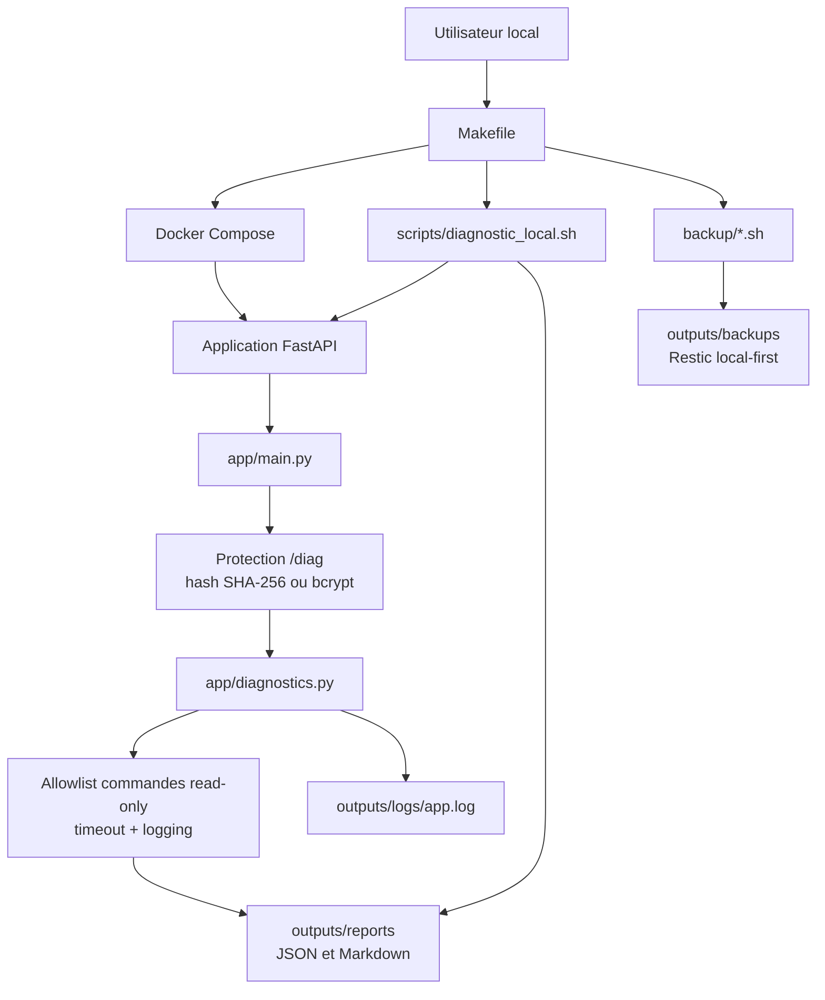

# Architecture du projet

## Objectif

Ce projet est un lab d’apprentissage autour de Linux, des réseaux, de Docker, de FastAPI, de l’automatisation et de la cybersécurité défensive.

L’objectif est de construire progressivement une application capable de :

- exposer une API minimale ;
- lancer des diagnostics systèmes/réseaux en lecture seule ;
- produire des rapports techniques ;
- être déployée plus tard sur VPS ;
- intégrer progressivement l’API OpenAI ;
- intégrer OpenClaw de manière contrôlée.

## Architecture actuelle



Flux principal :

1. `Makefile` orchestre les commandes locales.
2. Docker Compose démarre l'API sur `127.0.0.1`.
3. `app/main.py` protège les routes `/diag` avec un hash de jeton.
4. `app/diagnostics.py` exécute uniquement les commandes read-only allowlistées.
5. Les rapports sont écrits dans `outputs/reports` et les logs dans `outputs/logs`.
6. Les scripts de backup Restic restent séparés des diagnostics API.

## Composants

### FastAPI

FastAPI expose une API simple permettant de vérifier l’état de l’application et de lancer des diagnostics contrôlés.

Endpoints actuels :

* `/health` : vérifie que l’application répond ;
* `/version` : affiche la version applicative ;
* `/diag` : retourne un diagnostic système/réseau structuré en lecture seule ;
* `/diag/export/json` : génère un rapport JSON local ;
* `/diag/export/markdown` : génère un rapport Markdown local.

### Module `app/diagnostics.py`

Le module `app/diagnostics.py` centralise la collecte de diagnostic avancé. Il utilise uniquement la bibliothèque standard Python, exécute les commandes sans `shell=True`, applique des timeouts courts et gère les commandes absentes sans exception non contrôlée.

Il collecte :

* informations système ;
* interfaces réseau ;
* routes ;
* DNS ;
* ports ouverts ;
* disque ;
* mémoire ;
* état Docker en lecture seule.

Il produit également les exports JSON et Markdown dans `outputs/reports`.

Le module journalise les commandes lancées, les commandes absentes, les timeouts et l'écriture des rapports via la bibliothèque `logging`. Le fichier par défaut est `outputs/logs/app.log`, ignoré par Git.

### Docker Compose

Docker Compose permet de lancer l’application dans un environnement reproductible.

Objectifs :

* éviter les différences entre machines ;
* simplifier le lancement ;
* préparer le futur déploiement VPS.

### Makefile

Le Makefile sert d’interface de commande simple.

Exemples :

```bash
make build
make up
make health
make version
make diag
make diag-json
make diag-md
make reports
make down
```

### Scripts

Les scripts servent à automatiser certaines tâches d’installation, de diagnostic ou de vérification.

Le script `scripts/diagnostic_local.sh` génère un rapport Markdown local en lecture seule et sauvegarde aussi la réponse JSON de `/diag` dans `outputs/reports` si l’API est disponible.

## Architecture cible

```text
VM Ubuntu 26.04 LTS Server
   ↓ développement, tests et validation de reproductibilité prioritaire
GitHub
   ↓ versionnement puis CI plus tard
VPS Ubuntu
   ↓ Docker Compose
Application FastAPI
   ↓
Diagnostics systèmes/réseaux en lecture seule
   ↓
Rapports Markdown / JSON disponibles localement
   ↓
Résumé IA via OpenAI API plus tard
   ↓
Interaction contrôlée via OpenClaw plus tard
```

## Évolution prévue

### Étape 1 — Local Ubuntu Server

Le projet cible prioritairement une VM Ubuntu 26.04 LTS Server.

Fedora 44 reste une cible secondaire utile pour vérifier la portabilité. Ubuntu 24.04.4 LTS Desktop est conservée comme historique validé à 100 %.

### Étape 2 — Qualité

Ajout de tests, lint et GitHub Actions.

### Étape 3 — VPS

Déploiement sur VPS avec SSH sécurisé, firewall et HTTPS.

### Étape 4 — OpenAI API

Utilisation de l’API OpenAI pour résumer les rapports et proposer des pistes d’analyse.

### Étape 5 — OpenClaw

Utilisation d’OpenClaw avec allowlist stricte et commandes en lecture seule.

## Principes d’architecture

* commencer simple ;
* documenter chaque décision ;
* privilégier la reproductibilité ;
* limiter les droits ;
* ne pas automatiser de commandes destructives ;
* ajouter l’IA progressivement.
